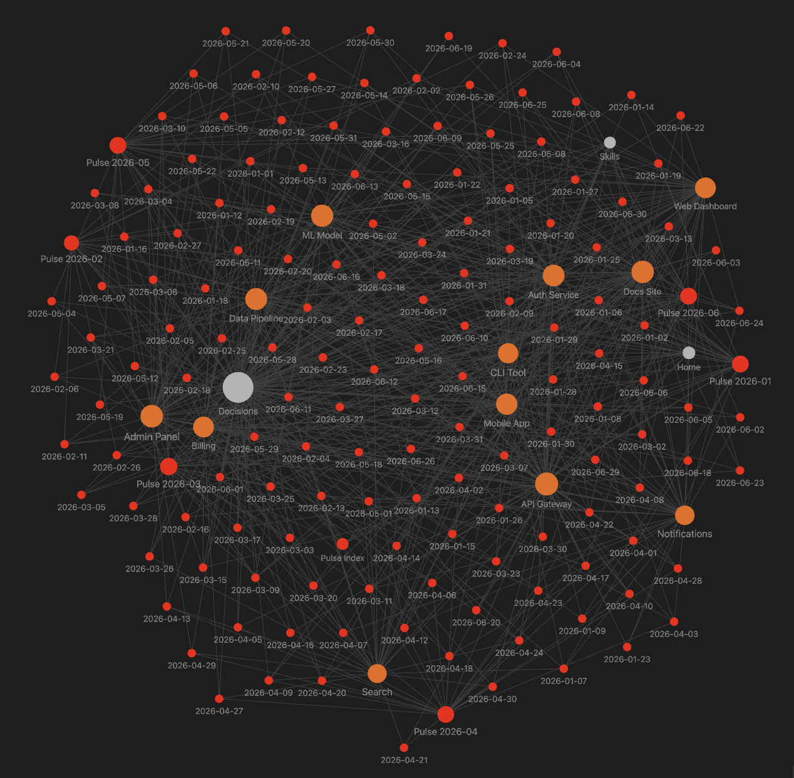

# Pulse

A memory layer for your work with Claude Code. It quietly remembers every session and turns it into a knowledge base you own.



*Every session becomes a linked note. Over months it builds a connected map of what you have built, shown here as an Obsidian graph.*

You finish a week of building and most of it is already gone. What did I ship on Tuesday? Why did I switch that service off Postgres? It is all buried in old terminal scrollback you will never read again.

Pulse fixes that. It records every Claude Code session to a database you own, and each night it writes a plain-markdown note of what you actually did, grouped by project, ready to open in Obsidian. The notes read like a person wrote them, not an AI, so they still make sense to you months later. Your work stops disappearing.

Your data lives in your own [Convex](https://convex.dev) deployment (free tier) and your own notes repo. There is no Pulse server, and no account to create with us.

A day looks like this:

```markdown
---
date: "2026-06-02"
tags: [pulse, daily]
source: claude-code
---

# Tuesday, June 2, 2026

## Summary

Worked across 2 projects.

## Work log

### [[CLI Tool]]

- Cut cold-start of the local stack from 30s to 8s.
- Added `pulse deploy` with a dry-run flag and a diff preview.

### [[Notifications]]

- Moved delivery onto Kafka so retries survive a worker crash.
- Added per-channel opt-out honored across email and push.

## Decisions & signals

- Chose Redis over in-memory for rate limits so it survives pod restarts. See [[Decisions]].

## Next

- Follow up on open threads.
```

## More than a journal

The daily note is just the first thing Pulse makes. Underneath it is the real point: a structured, growing record of your work that other things can read from.

Because it is plain markdown you own, you can build on top of it:

- A **weekly recap** of everything you shipped.
- A **devlog** or a **brag document** you can hand to your manager or paste into a review.
- Draft **LinkedIn and X posts** about what you worked on this week, in your own words.
- An agent that knows the **skills you have actually used** across projects, and can act on that: draft your posts, or apply to jobs on your behalf.

Today Pulse writes the daily notes. The rest is where it is headed, and it is all buildable, because the foundation is just your own readable history.

## How it works

```
Claude Code session  ->  capture (a Stop hook)  ->  your Convex deployment
                                                          |
                            nightly digest (cloud routine)|
                                                          v
                                     daily note  ->  your notes git repo  ->  Obsidian
```

- **Capture** is a small `Stop` hook. After every turn it saves your prompt and the response. It is silent and never interrupts you.
- **Digest** reads a day of sessions, groups them by project, and writes one note. It links each note into a monthly index so the vault stays connected, runs a humanizer pass so the writing sounds human, and has a reviewer check the note against the raw sessions before saving.

There is no plugin to install. Capture is a hook in your Claude Code settings. The digest is a scheduled cloud routine that runs the code in this repo.

## Requirements

- Claude Code
- Node.js 18 or newer (for the Convex CLI)
- A free Convex account
- A git repo for your notes (any GitHub repo works, and you can open it in Obsidian)

## Setup

Clone the repo and ask Claude to set it up:

```
git clone https://github.com/muhammademanaftab/pulse.git
cd pulse
```

Then, in Claude Code, say **"set up pulse"**. Claude follows the runbook
([skills/setup/SKILL.md](skills/setup/SKILL.md)) and walks you through three steps:

1. **Capture:** deploys your Convex backend, stores your credentials, wires the hook. You log in to Convex in your browser once, when Claude asks.
2. **Daily notes:** Claude asks where your notes should live (it can create `~/pulse-notes`, or use a path you give), writes the config for you, and shows you a first note.
3. **Nightly routine (optional):** Claude walks you through the cloud routine so notes build every night on their own.

If you would rather run the mechanical parts yourself:

```
python3 skills/setup/install.py                                       # capture
python3 skills/setup/install.py notes --repo ~/pulse-notes --create   # notes config
```

After setup, capture is on and every session is recorded.

## Where the notes live

The digest writes into your notes repo, never into this one:

```
<your-notes-repo>/
|- Pulse/
   |- Daily/
   |  |- Pulse Index.md
   |  |- 2026-06/
   |     |- Pulse 2026-06.md   (month hub)
   |     |- 2026-06-25.md      (a daily note)
   |- Projects/
```

The nightly digest runs as a claude.ai routine and works with your machine off. See
[routines/](routines/) for the routine and the exact fields to fill in.

## Configuration

Copy [`config.example.yaml`](config.example.yaml) to `~/.pulse/config.yaml` and point it at your notes:

| Key | Meaning |
|---|---|
| `timezone` | your timezone, for grouping a day's work |
| `notes_repo` | path to your notes git repo |
| `vault_subfolder` | folder inside it for daily notes (default `Pulse/Daily`) |
| `hub_prefix` | name prefix for the monthly index |

## Status

Pulse is early (0.x). Capture and the daily-note digest work today. The weekly recap, per-project notes, and the output agents (devlog, brag document, LinkedIn and X drafts, skill-aware agents) are planned, not built yet. Expect rough edges and breaking changes until 1.0.

## License

[MIT](LICENSE).
