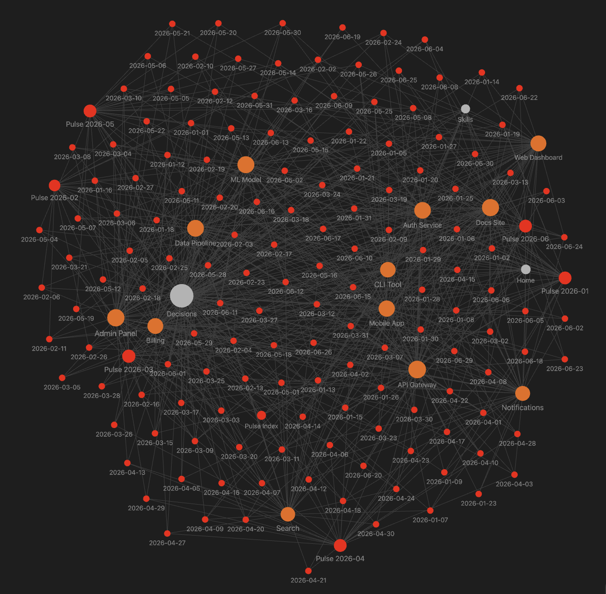

# Pulse

A memory layer for your work with Claude Code. It quietly remembers every session and turns it into a knowledge base you own.



*Every session becomes a linked note. Over months it builds a connected map of what you have built, shown here as an Obsidian graph.*

You finish a week of building and most of it is already gone. What did I ship on Tuesday? Why did I redo that whole feature? It is buried in old chat history you will never scroll through again.

Pulse fixes that. It records every Claude Code session to a database you own, and each night it writes up your day, grouped by project, ready to open in Obsidian. It writes the way you would write a journal, plain and clear, so it still makes sense to you months later. Your work stops disappearing.

Your data lives in your own [Convex](https://convex.dev) deployment (free tier) and your own notes repo. There is no Pulse server, and no account to create with us. For what is captured and how it is protected, see [SECURITY.md](SECURITY.md).

A day looks like this:

```markdown
---
date: "2026-06-02"
tags: [pulse, daily]
source: claude-code
projects:
  - "[[Web App]]"
  - "[[Notifications]]"
---

# Tuesday, June 2, 2026

## Summary

Made the app open much faster, fixed a bug that was dropping some notifications, and decided to keep people signed in for longer. The notification fix still needs a load test.

## Work log

### [[Web App]]

- Outcome: The home page opens in about 1 second instead of 4, and changes can be previewed before they go live.
- Added a "preview before you publish" button. Deployed.
- Decided: keep people signed in for 30 days. Why: being asked to log in every visit was the top complaint. Rejected: a 7 day session.
- Rule: anything that deletes data asks "are you sure?" first.
- Open: Add the preview button to the mobile app too.

### [[Notifications]]

- Outcome: Emails and alerts no longer get lost, and people choose which alerts they get.
- Bug: some alerts never arrived. Cause: two workers picked the same job and one dropped it. Fix: lock each job before sending (PR #42).
- Open: Load test the fix before turning it on for everyone.

## Open loops

- [ ] Add the preview button to the mobile app too. (Web App, since Jun 2)
- [ ] Load test the fix before turning it on for everyone. (Notifications, since Jun 2)
- [x] Pick a session length. (Web App, since May 29, done Jun 2)
```

## More than a journal

Pulse is built from small skills. The daily note is the first one: it reads your day and writes it up like you would.

Every other skill just reads those notes. Once your days are written down, you can add more:

- A **weekly recap** of what you got done.
- A **devlog** or a **brag document** for your manager or a review.
- **LinkedIn and X posts** about your week, in your own words.
- A helper that **applies to jobs for you**, using the work you have actually done.

The daily note and the weekly recap work today. The rest are more of the same: small skills that read your notes. They are all possible because your history is plain files you own, not locked inside an app.

## How it works

```
Your Claude Code work  ->  Pulse captures it  ->  your own database
                                                        |
                                  every night           |
                                                        v
              a clear daily note  ->  your notes folder  ->  open in Obsidian
```

- **It captures** every Claude Code session while you work. You do not lift a finger.
- **Every night it writes one clear note** for the day, grouped by project, in plain English so it still makes sense months later.
- **Your notes stay yours.** They are plain files in your own folder, easy to read, search, and reuse.

## Requirements

- Claude Code
- Node.js 18 or newer (for the Convex CLI)
- A free Convex account
- A git repo for your notes (any GitHub repo works, and you can open it in Obsidian)

## Setup

Clone the repo and ask Claude to set it up:

```
git clone https://github.com/muhammademanaftab/pulse.git
cd pulse
```

Then, in Claude Code, say **"set up pulse"**. Claude follows the runbook
([skills/setup/SKILL.md](skills/setup/SKILL.md)) and walks you through three steps:

1. **Capture:** deploys your Convex backend, stores your credentials, wires the hook. You log in to Convex in your browser once, when Claude asks.
2. **Daily notes:** Claude asks where your notes should live (it can create `~/pulse-notes`, or use a path you give), writes the config for you, and shows you a first note.
3. **Nightly routine (optional):** Claude walks you through the cloud routine so notes build every night on their own.

If you would rather run the mechanical parts yourself:

```
python3 skills/setup/install.py                                       # capture
python3 skills/setup/install.py notes --repo ~/pulse-notes --create   # notes config
```

After setup, capture is on and every session is recorded.

## Where the notes live

The digest writes into your notes repo, never into this one:

```
<your-notes-repo>/
|- Pulse/
   |- Daily/
   |  |- Pulse Index.md
   |  |- 2026-06/
   |     |- Pulse 2026-06.md   (month hub)
   |     |- 2026-06-25.md      (a daily note)
   |- Weekly/
   |  |- Pulse Weekly Index.md
   |  |- 2026-06/
   |     |- Pulse Weekly 2026-06.md  (month hub)
   |     |- 2026-06-28.md            (a weekly note, week ending Sunday)
   |- Projects/
```

The nightly digest and the weekly synth both run as claude.ai routines and work with
your machine off. See [routines/](routines/) for the routines and the exact fields to
fill in.

## Configuration

Copy [`config.example.yaml`](config.example.yaml) to `~/.pulse/config.yaml` and point it at your notes:

| Key | Meaning |
|---|---|
| `timezone` | your timezone, for grouping a day's work |
| `notes_repo` | path to your notes git repo |
| `vault_subfolder` | folder inside it for daily notes (default `Pulse/Daily`) |
| `hub_prefix` | name prefix for the monthly index |

## Status

Pulse is early (0.x). Capture, the daily-note digest, and the weekly recap work today. Per-project notes and the output agents (devlog, brag document, LinkedIn and X drafts, skill-aware agents) are planned, not built yet. Expect rough edges and breaking changes until 1.0.

## License

[MIT](LICENSE).
